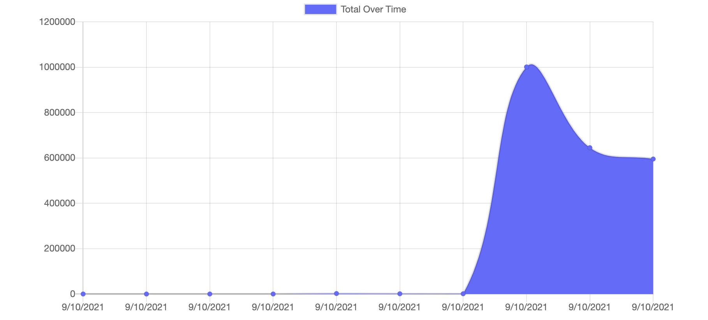

<h1 align ="center">Progressive Budget 👋</h1>

 
## Description
🔍 This is a reactive budget tracker that allows the user to keep track of their budget and see their progress throughout their financial journeys.
## Table of Contents
- [Description](#description)
- [Installation](#installation)
- [Usage](#usage)
- [License](#license)
- [Contributors](#contributors)
- [Tests](#tests)
- [Questions](#questions)

## Installation
💾 There is no need to install this app as it is deployed live for the user at 
## Usage
💻 This app is used to monitor the profit and the subtractions a user makes to their checking/savings accounts and gives them a nice graph to illustrate their progress.
## License

 
This application is covered by the Open license. 
## Contributing
👪 
## Troubleshooting
✏️ 
## Questions
✋ The best way to contact me with questions is by email, 
 
:octocat: Find me on GitHub: [drock4440](https://github.com/drock4440) 
 
✉️ Email me with any questions: Daltonrothrock8@gmail.com  
  